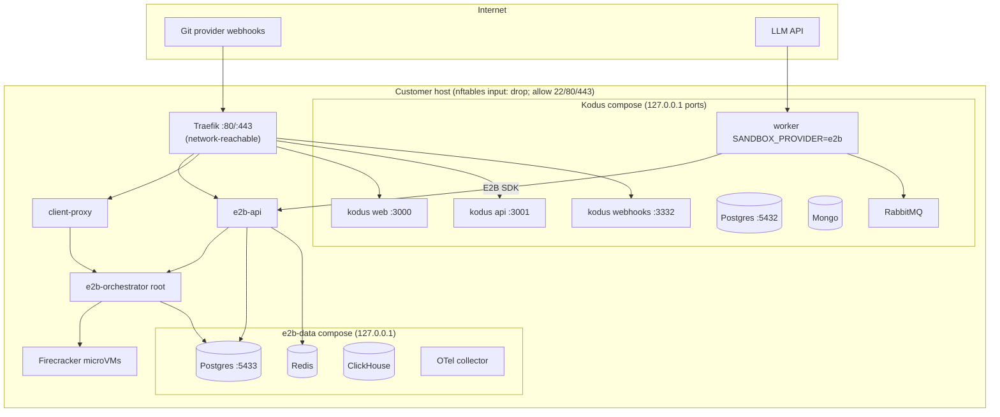

# Architecture

**Status:** M1 installer code is complete in this repository. **No end-to-end install has ever been executed on a customer or lab host.** The topology below matches the design spec and role READMEs; behaviour on real hardware is gated on Phase 0 (`docs/spike-notes.md`) and the installer-matrix CI leg.

## Single-node topology

One x86_64 Linux host runs Kodus (Docker Compose), E2B datastores (Docker Compose on `127.0.0.1`), E2B Go services (systemd host processes), Traefik (systemd), and Firecracker sandboxes on the same machine.

## Hostnames and routing

Traefik terminates TLS and routes by `Host`:

| Hostname | Backend | Notes |
|---|---|---|
| `kodus.<domain>` | `127.0.0.1:3000` | Web UI |
| `kodus-api.<domain>` | `127.0.0.1:3001` | API |
| `kodus-webhooks.<domain>` | `127.0.0.1:3332` | Webhooks at `/github/webhook`, etc. |
| `api.e2b.<domain>` | `127.0.0.1:8080` | E2B API (builds use loopback HTTP) |
| `*.e2b.<domain>` | `127.0.0.1:3002` | Sandbox edge via client-proxy |

Wildcard DNS for `*.e2b.<domain>` is required. Template builds intentionally target `http://127.0.0.1:8080` so TLS is not on the build path.

## Bind policy

**One policy, two facts:** only Traefik's ports 80 and 443 are reachable from the network. Traefik is the only process we *intend* to publish. E2B Go services (orchestrator, API, client-proxy) **hardcode `0.0.0.0`** by upstream design (not patched; see `ansible/roles/e2b_services` README). They are contained by the host nftables `qops_filter` input chain, which drops everything except loopback, established flows, SSH/HTTP/HTTPS, and orchestrator redirect targets from `veth-*` (TCP 5010–5012, 5016–5018). Kodus and E2B datastore ports are published on `127.0.0.1` via `docker-compose.override.yml` (`ports: !override`).

Sandbox egress policy is E2B’s default (internet allowed; RFC1918/CGNAT/loopback denied unless `e2b_allow_sandbox_internal_cidrs` is set for private git hosts).

## Request path: webhook → review → sandbox

1. Git provider delivers a webhook to `https://kodus-webhooks.<domain>/…` (public URL required).
2. Traefik forwards to the Kodus webhooks container on `127.0.0.1:3332`.
3. Kodus API/worker enqueues work on RabbitMQ (`API_RABBITMQ_ENABLED=true`, `WORKER_ROLE=code-review`).
4. The worker uses the E2B SDK with `E2B_DOMAIN=e2b.<domain>`, `API_E2B_KEY`, and template aliases `kodus-sandbox` / `kodus-sandbox-graph`.
5. SDK calls reach `api.e2b.<domain>` (Traefik → E2B API → orchestrator gRPC).
6. Orchestrator starts a Firecracker microVM; sandbox traffic exits via client-proxy hostnames under `*.e2b.<domain>`.
7. Review output is posted back through the git provider API using credentials in Kodus `.env`.

Hairpin: the worker must resolve `api.e2b.<domain>` and sandbox hostnames to the host and reach Traefik. When customer DNS/NAT breaks hairpin, set `kodus_extra_hosts_hairpin` and explicit `E2B_API_URL` / `E2B_SANDBOX_URL` (see `ansible/roles/kodus/README.md`).

## Data locations

| Path | Contents |
|---|---|
| `/etc/qops/` | Operator config, `secrets.env`, E2B env files, Kodus persisted secrets |
| `/var/lib/e2b/storage` | E2B template/snapshot store (Local FS default) |
| `/orchestrator/` | Sandbox, template build, and build cache paths |
| `/mnt/hugepages` | hugetlbfs for Firecracker |
| `/fc-versions`, `/fc-kernels`, `/fc-busybox`, `/fc-envd` | Mirrored Firecracker artifacts |
| `/usr/local/lib/e2b/<version>` | E2B dist binaries and migrations |
| `/opt/kodus-installer` | Upstream `kodustech/kodus-installer` checkout |
| `/var/backups/qops/` | Local backup bundles from `qops-backup` timer |

Paused-sandbox snapshot dirs under the template store are **not** garbage-collected by upstream on Local FS; `qops-e2b-gc` prunes unreferenced build IDs (see `ansible/roles/backup/README.md`).

## What is not verified

- Multi-node / Nomad deployment (deferred).
- `tls_mode: internal_ca`, S3/NFS storage backends (M2).
- Production load, nested-virt timings, or customer network edge cases.
- Any claim that this topology has run successfully outside CI unit tests and (when secrets are configured) the GitHub `installer-matrix` workflow.
